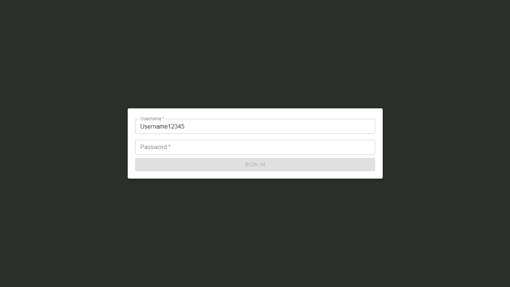
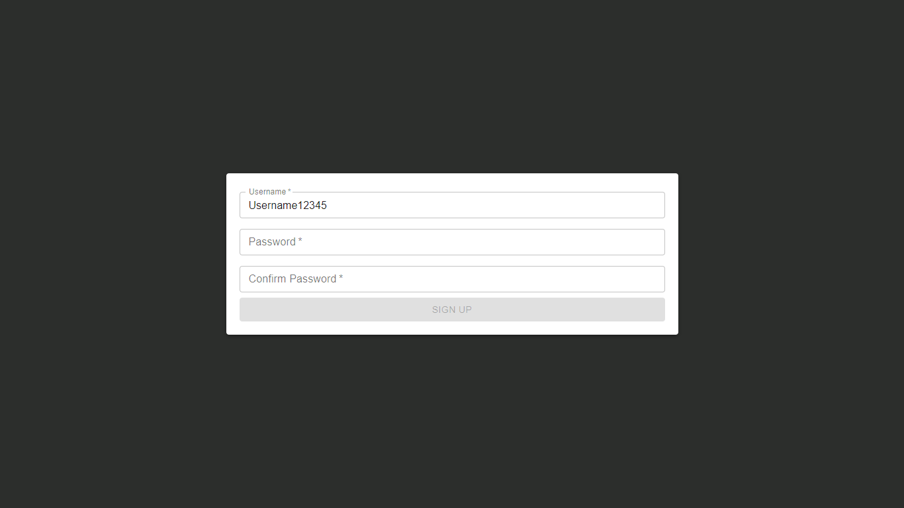
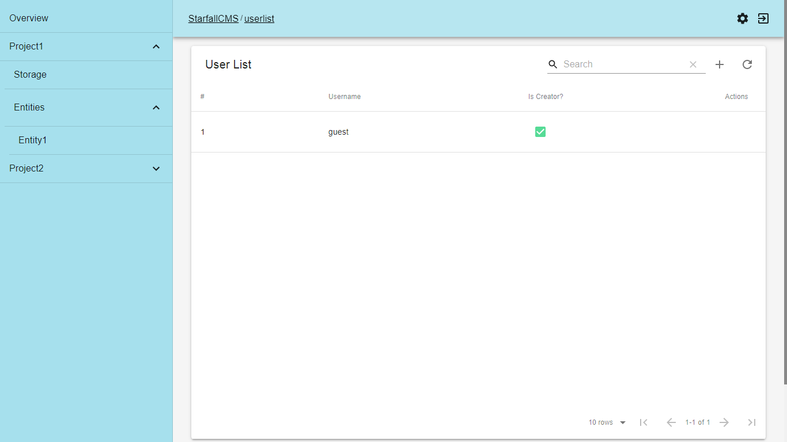
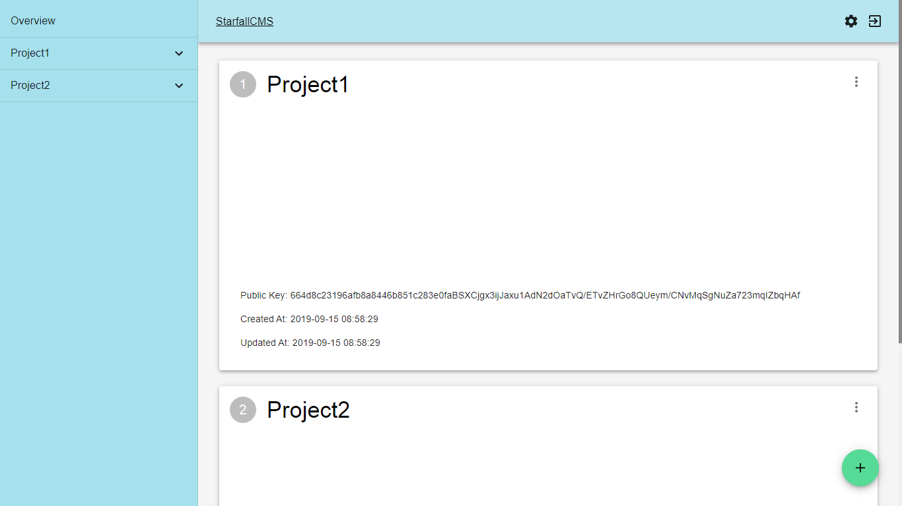
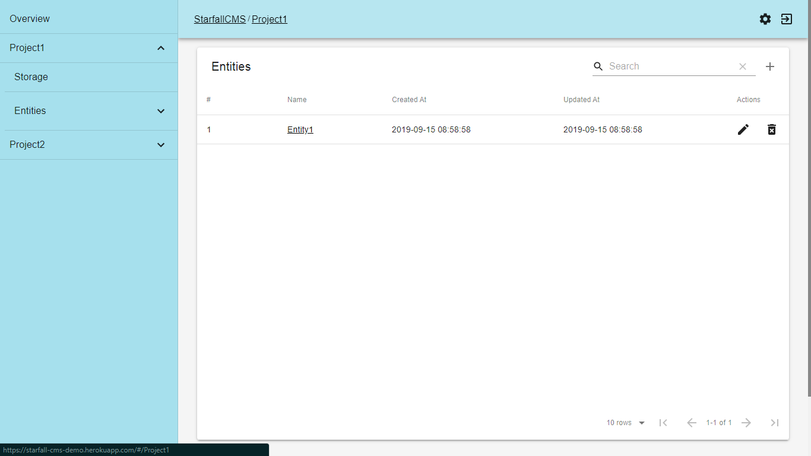
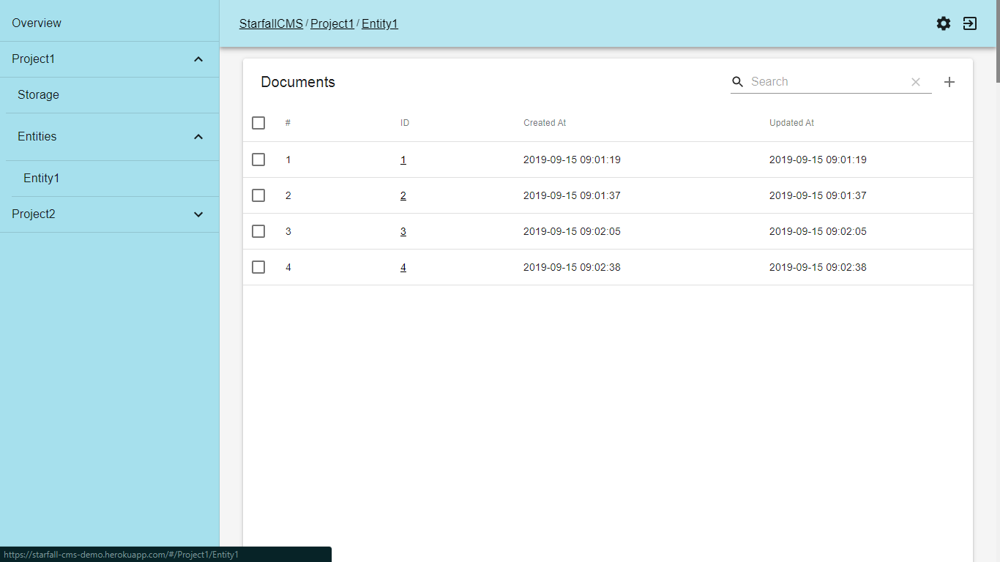
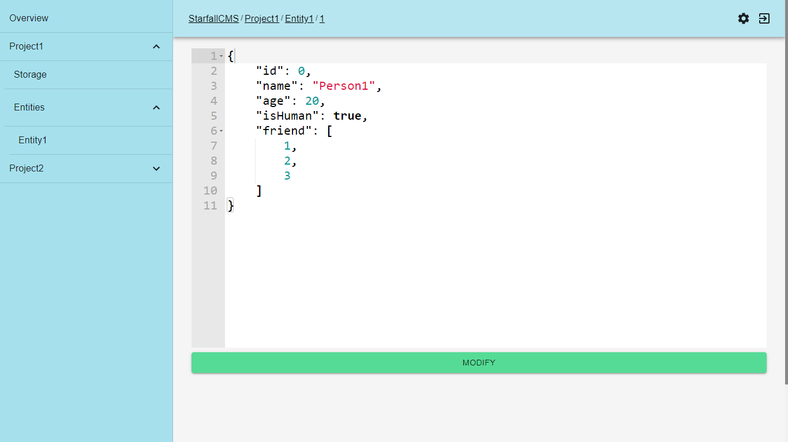
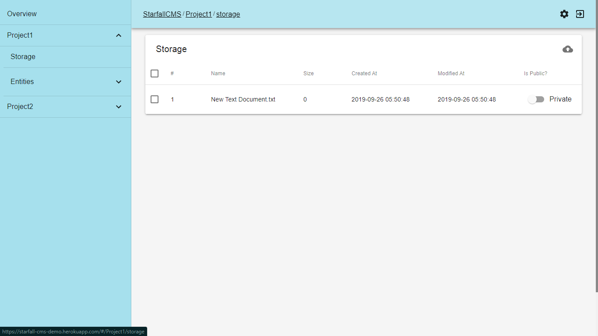

# Client Interface
## Authorization
_StarfallCMS Client Application_ protect data by using authorization, so that only authorized user can access _StarfallCMS Client Application_.  
  
At _StarfallCMS_ initialization, user will be greeted by __Sign Up__ page. User must create account first to proceed. The first account created will be checked as __Creator__. __Creator__ account and normal account have different type of authorities. After creating __Creator__ account, user can proceed to __Sign In__ page.
  
|                              |   Creator Account  |   Normal Account   | 
| ---------------------------- | :----------------: | :----------------: |
| __Add Normal Account__       | :heavy_check_mark: |         :x:        |
| __Delete Normal Account__    | :heavy_check_mark: |         :x:        |
| __Add Project__              | :heavy_check_mark: |         :x:        |
| __Rename Project__           | :heavy_check_mark: |         :x:        |
| __Delete Project__           | :heavy_check_mark: |         :x:        |
| __Change Project Thumbnail__ | :heavy_check_mark: |         :x:        |
| __Add Entity__               | :heavy_check_mark: | :heavy_check_mark: |
| __Rename Entity__            | :heavy_check_mark: | :heavy_check_mark: |
| __Delete Entity__            | :heavy_check_mark: | :heavy_check_mark: |
| __Add Document__             | :heavy_check_mark: | :heavy_check_mark: |
| __Modify Document__          | :heavy_check_mark: | :heavy_check_mark: |
| __Delete Document__          | :heavy_check_mark: | :heavy_check_mark: |
| __Upload File__              | :heavy_check_mark: | :heavy_check_mark: |
| __Rename File__              | :heavy_check_mark: | :heavy_check_mark: |
| __Delete File__              | :heavy_check_mark: | :heavy_check_mark: |
| __Change File Access__       | :heavy_check_mark: | :heavy_check_mark: |  

## User List
__User List__ page is a page that only __Creator__ can enter. __User List__ page will show list of accounts, and __Creator__ can adds or deletes __Normal__ account.  

## Overview
__Overview__ page is a page that show list of projects with many details of it, and User can add new project, rename project, delete project and change project thumbnail. In __Overview__ page, __Creator__ has higher authority while non __Creator__ user can only view __Overview__ page.  
  
Project properties
- Title: Describes project name. Use project name in :project param when accessing public API.
- Project Thumbnail: Thumbnail cover of project.
- Project Key : Use this key to access public API. Project Key will be generated at first time project created or when renaming project.
- Modified At: Describes last time project is modified.
- Created At: Describes when project is created.

## Project
__Project__ page is a page that show list of entities in project. User can add new entity, rename entity and delete entity. 
  
Entity properties
- Name: Describes entity name. Use entity name in :entity param when accessing public API.
- Modified At: Describes last time entity is modified.
- Created At: Describes when entity is created.

## Entity
__Entity__ page is a page that show list of documents in entity. User can add new document and delete multiple documents.
  
Document properties
- ID: Describes document id.
- Modified At: Describes last time document is modified.
- Created At: Describes when document is created.

## Document
__Document__ page is a page to add or edit document. User can edit document content by using __JSON Editor__ in __Document__ page. __JSON Editor__ provides type checking to prevent error and will not let user to add or modify document in server until syntax in document right.  
  
__StarfallCMS__ stores document with type of JSON, so user can store data in document freely as long as JSON support. Document stored will be very confusing if user just store data freely, so StarfallCMS provides multiple entities to organize document with same schema.

## Storage
__Storage__ page is a page that show list of files in project. User can upload new files, rename filename, delete files and change file access authority.  

